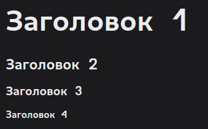

# Работа с Markdown

**Markdown** - это легкий язык разметки, который используется для форматирования текста. Форматирование текста в **Markdown** осуществляется с помощью тегов.

## Основные теги

### Заголовки

Заголовки в **Markdown** задаются с помощью символов `#`. Количество символов `#` определяет уровень заголовка.
Альтернативный способ задания заголовков - использование символов `=` и `-`.

```md
# Заголовок 1

## Заголовок 2

### Заголовок 3

#### Заголовок 4
```

На странице будет отображаться следующее:

> 

:::note

Первые два уровня заголовков можно также задавать с помощью символов `=` и `-`.

```md
Заголовок 1
============

Заголовок 2
------------
```
:::

### Абзацы

Абзацы в **Markdown** задаются с помощью пустых строк.

```md
Это абзац. 
Если не добавить пустую строку, то текст не будет переноситься на новую строку.


Это другой абзац.
```
На странице будет отображаться следующее:
> Это абзац. 
> Если не добавить пустую строку, то текст не будет переноситься на новую строку.
> 
> Это другой абзац.

### Шрифты

Шрифты в **Markdown** задаются с помощью символов `*`, `_`, `**`, `__`.

```md
*Курсив*
_Курсив_
**Жирный**
__Жирный__
```

На странице будет отображаться следующее:
> *Курсив*
> _Курсив_
> **Жирный**
> __Жирный__

### Списки

Списки в **Markdown** задаются с помощью символов `*`, `+` или `-`.

```md
* "*"-список
* "*"-список
* "*"-список
+ "+"-список
+ "+"-список
+ "+"-список
- "-"-список
- "-"-список
- "-"-список
```

На странице будет отображаться следующее:
> * "*"-список
> * "*"-список
> * "*"-список
> + "+"-список
> + "+"-список
> + "+"-список
> - "-"-список
> - "-"-список
> - "-"-список

Также можно использовать нумерованные списки.

```md
1. Первый элемент
2. Второй элемент
3. Третий элемент
```

На странице будет отображаться следующее:
> 1. Первый элемент
> 2. Второй элемент
> 3. Третий элемент

:::info

Списки можно вкладывать друг в друга.

```md
* Главный элемент
    * Вложенный элемент
        1. Подэлемент
        2. Подэлемент
        3. Подэлемент
    * Вложенный элемент
        1. Подэлемент
        2. Подэлемент
        3. Подэлемент
```

На странице будет отображаться следующее:
> * Главный элемент
>     * Вложенный элемент
>         1. Подэлемент
>         2. Подэлемент
>         3. Подэлемент
>     * Вложенный элемент
>         1. Подэлемент
>         2. Подэлемент
>         3. Подэлемент
:::

### Цитаты

Цитаты в **Markdown** задаются с помощью символов `>`.

```md
> Цитата
```

На странице будет отображаться следующее:
> > Цитата

### Примечания

Docusaurus позволяет добавлять примечания к тексту. Доступны следующие типы примечаний:

- `note`
- `tip`
- `info`
- `warning`
- `danger`

```md
:::note
Заметка
:::

:::tip
Подсказка
:::

:::info
Дополнительная информация
:::

:::warning
Внимание
:::

:::danger
Нежелательное действие
:::

```

На странице будет отображаться следующее:
> :::note
> Заметка
> :::
> 
> :::tip
> Подсказка
> :::
> 
> :::info
> Дополнительная информация
> :::
> 
> :::warning
> Внимание
> :::
> 
> :::danger
> Нежелательное действие
> :::
