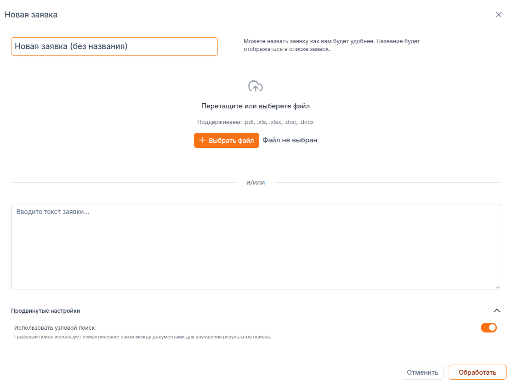

# Работа в разделе "Заявки"

В данном разделе вы можете создавать, просматривать, редактировать и удалять заявки.

## Создание заявки

Для создания заявки, вам необходимо нажать на кнопку "Добавить заявку" в правом верхнем углу. В результате появится форма для заполнения.

В первую очередь необходимо дать заявке удобное наименование, по которому ее можно будет легко найти.

Если заявка состоит из файла, файл можно перетащить на обозначенное поле, или выбрать обычным способом по кнопке "Выбрать файл".

:::warning
Поддержка формата PDF пока экспериментальна. Есть высокая вероятность, что обработка заявки не сработает.
:::

Если заявка пришла по почте или через мессенджер в виде неструктурированного текста, вставьте его в поле "Текст заявки".

## Поиск заявки

## Просмотр заявки

## Редактирование заявки

## Удаление заявки
